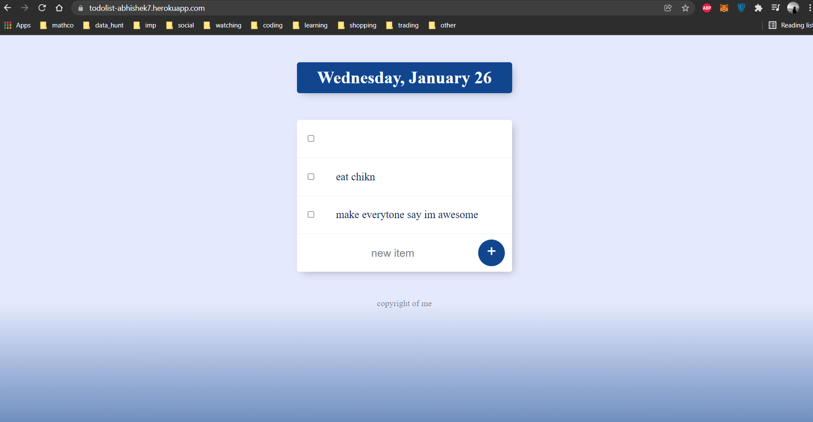
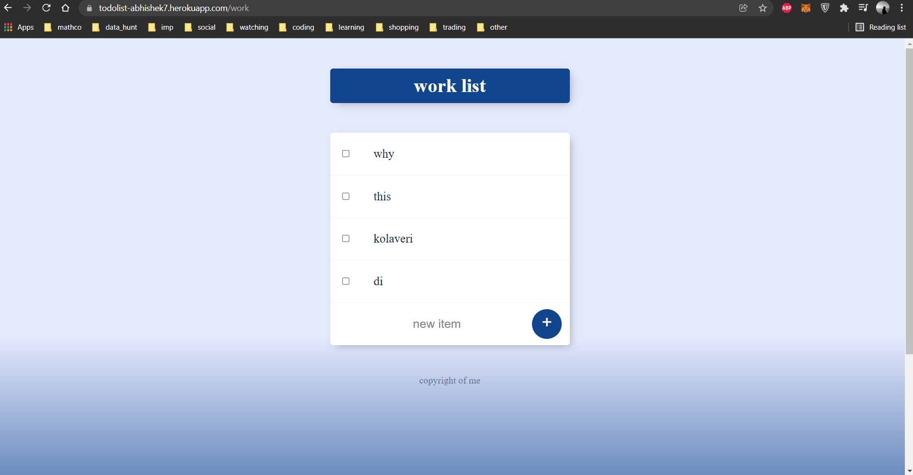
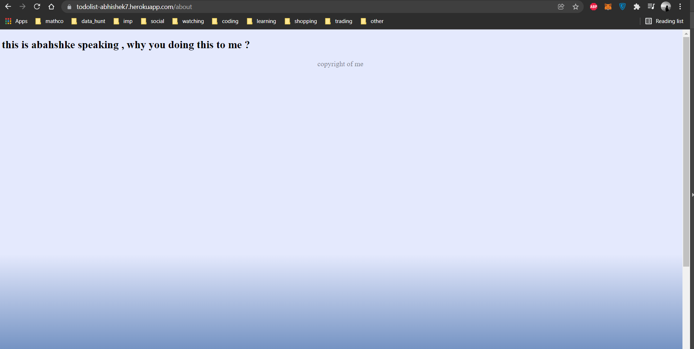

# todolist

working with ejs and module exports in javascripts to make multiple pages 

- <h4>https://todolist-abhishek7.herokuapp.com/</h4>

- <h4>https://todolist-abhishek7.herokuapp.com/work</h4>

- <h4>https://todolist-abhishek7.herokuapp.com/about</h4>

